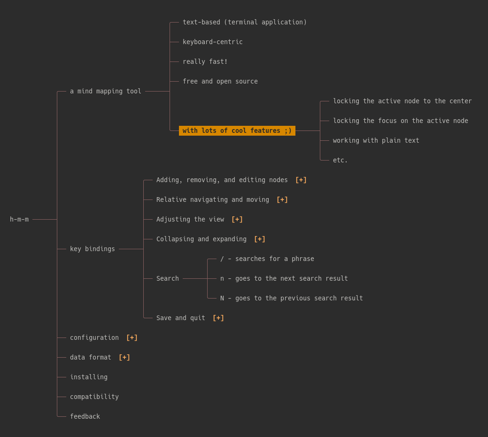

# h-m-m (hackers mind map)

**h-m-m** (pronounced like the interjection "hmm") is a simple, fast, keyboard-centric terminal-based tool for working with mind maps. 




# Key bindings

Adding, removing, and editing nodes:

* `o` or `Enter` - create a new sibling to the active node
* `O` or `Tab` - create a new child for the active node
* `y` - yanks (copies) the active node and its descendants
* `Y` - yanks (copies) the descendants of the active node
* `d` - deletes (cuts) the active node and its descendants
* `D` - deletes (cuts) the descendants of the active node
* `Delete` - deletes the active node and its descendants without putting them in the clipboard 
* `p` - pastes as descendants of the active node
* `P` - pastes as siblings of the active node 
* `Ctrl+p` - appends the clipboard text at the end of the active node's title
* `e`, `i`, or `a` - edits the active node
* `E`, `I`, or `A` - edits the active node, ignoring the existing text
* `u` - undo
* `Ctrl+r` - redo

Relative navigating and moving:

* `h` or `←` - activate the parent of the previously active node
* `l` or `→` - activate the middle child of the previously active node
* `j` or `↓` - activate the lower sibling (or the nearest lower node if there's no lower sibling)
* `k` or `↑` - activate the higher sibling (or the nearest higher node if there's no higher sibling)
* `J` - moves the current node down among its siblings
* `K` - moves the current node up among its siblings

Adjusting the view:

* `c` - centers the active node on the screen
* `C` - locks and always keeps active nodes on the center 
* `~` or `m` - activate the root element
* `g` - goes to the highest element
* `G` - goes to the lowest element
* `w` - increases the maximum node width
* `W` - decreases the maximum node width
* `z` - decreases line spacing
* `Z` - increases line spacing 

Collapsing and expanding:

* `Space` - toggles the active node
* `v` - collapses everything other than the first-level nodes
* `b` - expands all nodes
* `1` to `9` - collapse the nth level and expand those before
* `f` - focuses by collapsing all, but the ancestors and descendants of the active node
* `F` - locks focus as the active node changes (try it with the center lock)
* `r` - collapses all the first level items except for the one that contains the active node
* `R` - collapses the children of the active node

Search:

* `/`, `?`, or `Ctrl+f` - searches for a phrase
* `n` - goes to the next search result
* `N` - goes to the previous search result

Save, export, and quit:

* `s` - saves with the previous file name (or asks for one if there's none)
* `S` - saves with a new file name
* `x` - export as HTML
* `q` - quits (if the changes were already saved)
* `Q` - quits, ignoring the changes

In the text editor:

* `↓` - move the cursor to the end of the line
* `↑` - move the cursor to the beginning of the line
* `←` or `Home` - move the cursor to the left
* `→` or `End` - move the cursor to the right
* `Ctrl+Left` or `Shift+Left` - move cursor to the previous word
* `Ctrl+Right` or `Shift+right` - move cursor to the next word
* `Delete` - delete character
* `Ctrl+Delete` - delete word
* `Backspace` - delete previous character
* `ctrl+Backspace` - delete previous word
* `Ctrl+v` or `Ctrl+Shift+v` - paste
* `Esc` - cancel editing
* `Enter` - wanna guess? ;)


# Configuration 

The following are the settings in h-m-m:

    max_parent_node_width = 25
    max_leaf_node_width = 55
    line_spacing = 1
    initial_depth = 1
	center_lock = false
	focus_lock = false
	max_undo_steps = 24
    active_node_color = "\033[38;5;0m\033[48;5;172m\033[1m"
    message_color = "\033[38;5;0m\033[48;5;141m\033[1m"

The colors are ASCII escape codes. 

You have 3 different ways of setting those values: 

1. Pass them as arguments when running the program; e.g., `h-m-m --focus-lock=true --line-spacing=0 filename`
1. Set them as environment variables with `hmm_` as prefix; e.g., `hmm_line_spacing=0`
1. Store them in a config file. You can pass the location of the config file when running the application like `h-m-m --config=/path/file`, or use the default location:
   * Linux: ~/.config/h-m-m/h-m-m.conf
   * Mac: ~/Library/Preferences/h-m-m/h-m-m.conf
   * Windows: an h-m-m.conf file in the same directory as the script

Both underscores and dashes are accepted for the setting keys.

When multiple values exists, the highest priority goes to the command line arguments and the lowest to the config file. 


# Data format

Mind maps are stored in plain text files (with `hmm` file extension by default) without metadata. The tree structure is represented by tab indentations; e.g., 

    root (level 0)
       item A (level 1)
       item B (level 1)
          item Ba (level 2)
          item Bb (level 2)
          item Bc (level 2)
             item BaX (level 3)
             item BaY (level 3)
          item Bd (level 2)
       item C (level 1)

When you yank (copy) or delete (cut) a subtree, the data will be put into your clipboard with a similar structure, and when pasting, the data will be interpreted as such. 

Most mind mapping applications use a similar format for copying and pasting. As a result, if you want to import a map from another application, you can probably select everything in that application, copy it, come to **h-m-m**, and paste it. The same usually works well when copying from HTML/PDF/Doc lists, spreadsheets (e.g., Calc and Excel), etc.


# Installing 

Note: A few issues should be solved before **h-m-m** can be run in Windows. Until then, Windows users can probably use *Windows Subsystem for Linux* to run it.


## 1. Manual installation 

**h-m-m** is a single php file. You can download it from here, or clone it on your computer using git and add a scheduled job to update it once a day or week. 

You also need to have the following installed for h-m-m to work:

* php
  * either php 8, or
  * older versions of php along with the `mbstring` package (e.g., `php7.2-mbstring`)
* `xclip`, `xsel`, or `wl-clipboard` in Linux. (Windows and Mac don't need it)

After downloading or cloning, you can run `php h-m-m` in your terminal to run the program with a blank map or `php h-m-m filename` to open an existing file. If you don't already have a php interpreter installed, you would need to install it as well. Note: You don't need to set up a "web server" to run it because it's not a web application, but rather a terminal application that works like those written in Python, Bash, etc. 
 
Optionally, you can make the file executable by running the `chmod +x h-m-m` in your terminal, and afterward, you can run it as `h-m-m filename` (assuming that **h-m-m** is in your path). 


## 2. Installation for Arch Linux

In Arch Linux, you can use the `h-m-m-git` AUR package to install it.


## 3. Installation script for Linux (and Mac?)

You can run the following command to install h-m-m:

```sh
wget -q -O - 'https://raw.githubusercontent.com/nadrad/h-m-m/main/install.sh' | sh
```

This command downloads and runs the install.sh script, which it turn downloads h-m-m, copies it to `/usr/local/bin`, checks the dependencies, and makes it executable. 

After installing, you can run `h-m-m` from anywhere in your terminal to run the application with an empty map, or `h-m-m filename` to open an existing file.

Note: It probably works in a Mac, but I'm not completely sure; so, [let me know](https://github.com/nadrad/h-m-m/issues/27).


## 4. Installation with Docker

It's also possible to execute `h-m-m` through docker (or podman):

```sh
# Build the image
docker build -t hmm .

# Run it
docker run --rm -it -v $(pwd):/app/ hmm
```


# Compatibility 

I think the method I've used in this program to interact with the terminal emulator is general and standard enough to be cross-platform, but I've developed it in Linux and I don't have any other operating system to test it on. If you run into a problem in Windows or Mac, let me know, especially if you know how to fix it, and I'll try to make it work. 

Update: There's an [open issue](https://github.com/nadrad/h-m-m/issues/29) for Windows, waiting for contributors!


# Feedback

Programming is not my career, but rather a hobby, and I developed **h-m-m** because I wanted to have something like this and couldn't find one. Therefore, what I've done here may have a lot of room for improvement. If you see an embarrassing problem in the program or have an idea for improvement, feel free to contact me; I'd be happy to receive your feedback.

Why php? It's simple: I only have a rusty knowledge of Pascal and a little familiarity with php. I thought about learning another language for this project (Haskell and Go were my top choices), but I didn't have time to do it. I'll probably do it later and convert it into a language I can compile :)

